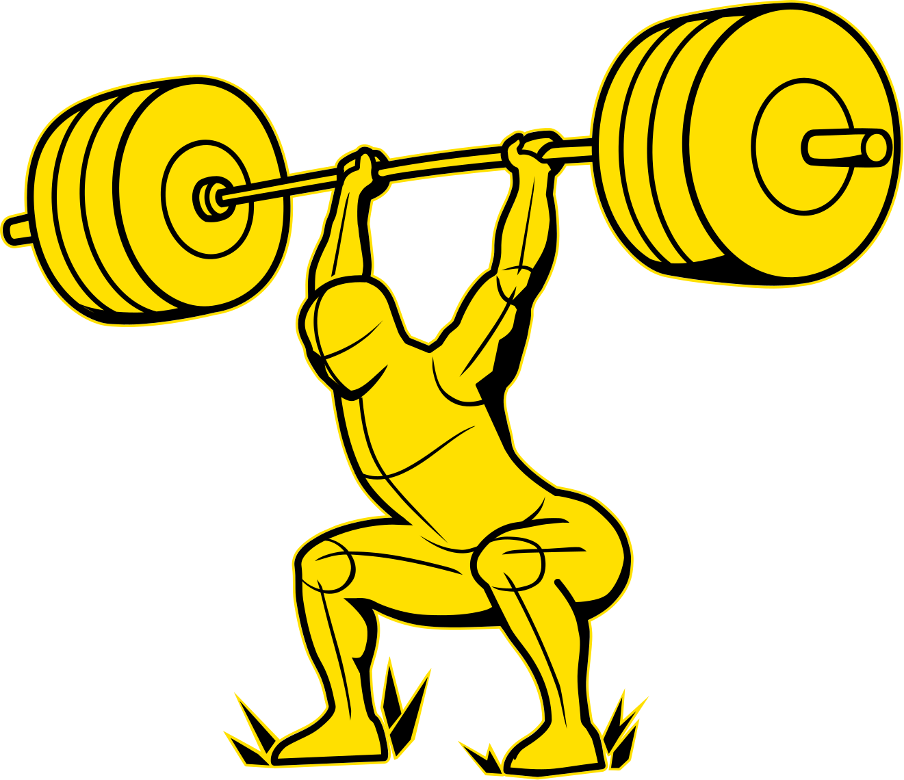
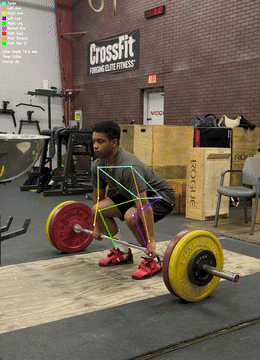
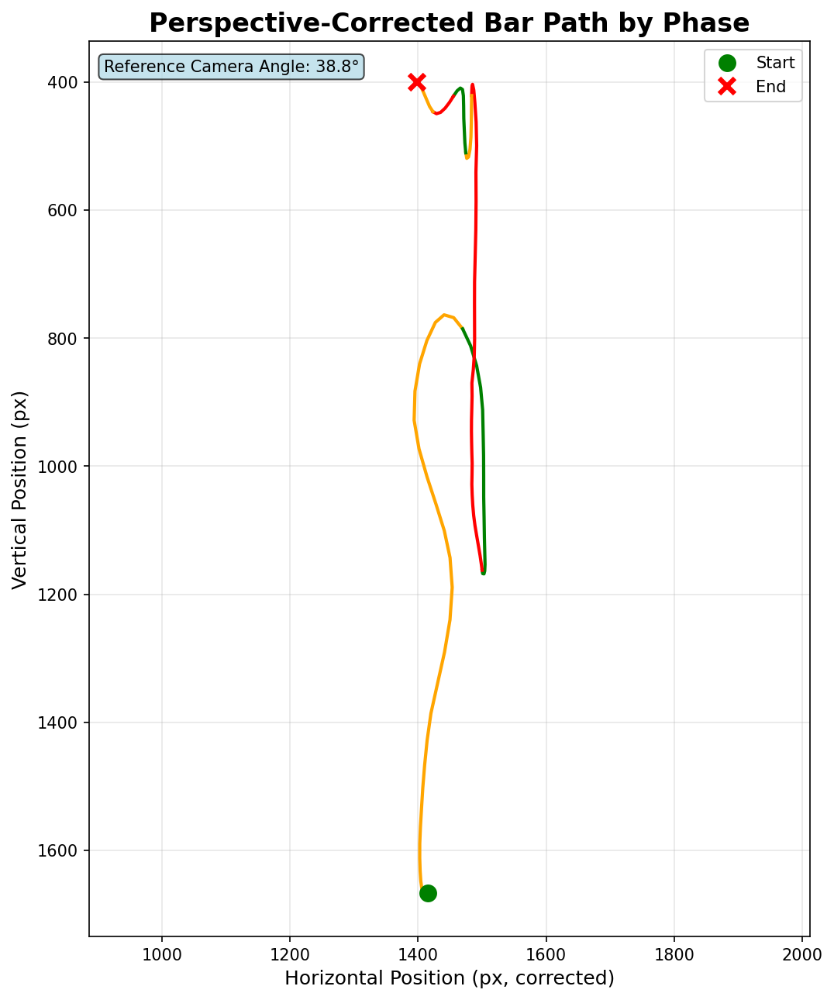

# BARPATH: AI-Powered Weightlifting Technique Analysis

**barpath** is an advanced biomechanical analysis tool that acts as a powerful training companion. Using computer vision and pose estimation, it analyzes Olympic lifts (clean, snatch) to provide detailed kinematic feedback, visualizations, and technique critiques.

[](https://www.python.org/downloads/)
[](LICENSE)
[]()

<div style="display: grid; grid-template-columns: repeat(3, 1fr); gap: 20px;">
    
    
</div>

## ✨ Features

- **🖥️ Dual Interface**: Command-line tool for batch processing and GUI for interactive analysis
  - **GUI**: Modern tabbed interface (Files, Settings, Analyze, Analysis tabs) — fully non-blocking via a dedicated background worker thread
  - **CLI**: Script-friendly command-line tool for batch processing with rich progress bars and detailed reporting
- **⚡ YOLO26 NMS-Free Detection**: Upgraded to Ultralytics YOLO26 for fast, accurate barbell endcap detection
  - End-to-end NMS-free architecture — eliminates post-processing step for faster inference
  - Compatible with `.pt`, `.onnx`, `.engine` (TensorRT), and OpenVINO export formats
  - Single confidence threshold (no separate IoU parameter required)
- **🔄 Producer-Consumer Video Pipeline**: Frame decoding and model inference run concurrently
  - A background I/O thread pre-fetches decoded frames into a bounded queue so the main inference thread is never idle waiting on disk reads
  - Bounded queue (size 8) prevents memory bloat while maintaining throughput
- **🎯 MediaPipe Pose Estimation**: Full-body joint tracking with configurable accuracy levels
  - **Model Complexity**: Choose between Light (0), Medium (1 — default), or Heavy (2) complexity
  - **Confidence Thresholds**: Adjustable detection and tracking confidence (default 0.5 each)
  - Tracks 12 joints: shoulders, hips, knees, ankles, elbows, wrists
  - Outputs both normalized (0–1) and world coordinates
- **🎯 Camera Shake Stabilization**: Lucas-Kanade optical flow on background features for perfectly stabilized bar path tracking
- **📐 Robust Perspective-Corrected Bar Path**: Converts the bar path from pixel space to real-world centimetres for any camera angle
  - **Dual-path scale derivation**: shoulder-width scale (Path A) for angled views; hip-to-shoulder vertical scale (Path B) for side-on shots — both produce valid cm outputs
  - **Stable single scalar**: outlier-rejected, SG-smoothed per-frame scale is reduced to one stable scalar (median of the early Pull phase) before converting pixel displacements — eliminates pull-under inflation artifacts
  - **IQR outlier rejection + interpolation + Savitzky-Golay smoothing** applied to the raw scale series to guard against MediaPipe landmark jitter and shoulder occlusion spikes
  - Both axes of the corrected graph are in real-world **centimetres** — physically meaningful and correctly proportioned at any camera angle
- **🔁 Reanalyze Existing Outputs**: Re-run analysis steps 2–5 on folders already processed by step 1
  - Skips the slow video decoding and detection step — reuse existing `raw_data.pkl`
  - Video re-render is attempted automatically if the original source video path is still valid
  - Available as a dedicated **"Add Folders (Reanalyze)"** button in the GUI
- **⚙️ Hardware-Accelerated Inference**: CPU-optimized inference with optional acceleration:
  - ONNX Runtime for cross-platform CPU optimization
  - OpenVINO support for Intel CPUs
  - TensorRT support for NVIDIA GPUs
- **📊 Comprehensive Kinematic Analysis**:
  - **All tracked MediaPipe joints are smoothed** (Savitzky-Golay filter, 11-frame window, cubic polynomial)
  - **Per-frame lifter angle tracking**: the lifter's camera-relative orientation is smoothed and recorded for every frame
  - Smoothed bar position, velocity, acceleration, and specific power graphs
  - Perspective-corrected bar path graph in real-world centimetres (both axes), smoothed after conversion
  - Frame-by-frame joint angle measurements (knees, elbows) — all smoothed
  - Data automatically truncated at peak bar height
  - All path graphs include generous horizontal padding for legend legibility
- **📍 3-Phase Lift Analysis** (Pull → Pull-under → Recovery):
  - **Pull** (Red): Barbell starts moving upward → lifter's hips reach peak extension
  - **Pull-under** (Orange): Hip extension peak → hips stop descending (catch position)
  - **Recovery** (Green): Catch → barbell reaches maximum height
  - Automatic phase detection using MediaPipe landmarks and kinematics
  - Color-coded in all output visualizations
- **📈 Superimposed Batch Comparison Graphs**: Compare multiple lifts on a single plot after batch processing
  - **Angle-compensated superimposed graph**: all lifts plotted in real-world cm (side-on lifts use vertical scale; angled lifts use shoulder-width scale)
  - **Smoothed pixel-space superimposed graph**: always-available fallback in pixel units
  - Non-reference lifts are **uniformly scaled** to align phase-transition markers with the reference lift for visual comparability
  - **DTW similarity percentage** computed for every non-reference lift vs the reference and displayed in the legend (e.g. `Lift 2  [95.1% match]`)
  - All paths are origin-normalised at the pull-under start point before overlay
- **🎥 Annotated Video Output**:
  - Skeleton overlay with stabilized bar path visualization
  - Color-coded bar path phases (Pull=red, Pull-under=orange, Recovery=green)
  - Persistent barpath overlay at the end of the lift for easier review
  - Optional video rendering (can be skipped with `--no-video` for faster analysis)
- **📋 Beautiful Analysis Reports**: Markdown-based reports rendered as formatted HTML
  - Kinematic data, graphs, and phase timing (Pull / Pull-under / Recovery)
  - Maximum specific power calculation (W/kg where available)
  - Technique findings and recommendations
  - Automatically displayed in the GUI Analysis tab
- **🔍 Rule-Based Technique Critique**: Identifies common faults in Olympic lifts
  - Supports Clean and Snatch lifts with lift-specific fault checks
  - Early arm bend, incomplete extension, poor transition timing, and more
  - Can be skipped with `--lift_type none` for non-Olympic lifts

## 🔧 Requirements

### 🧼 Code formatting & linting

We use [ruff](https://github.com/charliermarsh/ruff) to enforce a consistent style and catch common problems. A GitHub Actions workflow (`.github/workflows/ruff.yml`) runs `ruff check .` on every push and pull request; the job will fail if any issue is found.

Prospective contributors should run the same check locally before committing:

```bash
# install ruff (it's lightweight)
pip install ruff

# lint the repository – the command will exit non-zero if problems exist
ruff check .
```

You can also auto‑format with `ruff format .` or configure your editor to format on save.

Any code (hand‑written or agent‑generated) must pass ruff so the CI stays green.


### System Dependencies

| Dependency | Purpose | Installation |
|------------|---------|--------------|
| **Python 3.12+** | Runtime environment | [python.org](https://www.python.org/downloads/) |
| **FFmpeg** | Video processing / audio muxing | See below |
| **Git LFS** | Large file support (models) | See below |

Python packages are listed in `requirements.txt`.

## 📦 Installation

### 1. Install System Dependencies

**Ubuntu / Debian**
```bash
sudo apt update
sudo apt install ffmpeg python3-pip git git-lfs \
    libcairo2-dev pkg-config libgirepository-2.0-dev \
    gir1.2-gtk-3.0 libgirepository-2.0-0
```

**macOS**
```bash
brew install ffmpeg git git-lfs python
```

**Windows**
Install: [git](https://github.com/git-guides/install-git#install-git-on-windows) · [ffmpeg](https://ffmpeg.org/download.html) · [python](https://www.python.org/downloads/windows)

### 2. Clone the Repository

```bash
# Clone with Git LFS (downloads model files automatically)
git clone https://github.com/scribewire/barpath
cd barpath
```

### 3. Install Python Dependencies

```bash
pip install -r requirements.txt
```

This installs the core pipeline libraries (including `ultralytics>=8.3` for YOLO26 support, `mediapipe>=0.10.0`, and Toga GUI).

### 3.5. Optional: Install Hardware Acceleration (Recommended)

barpath can use hardware-accelerated inference for faster model processing.

#### Automatic Setup (Interactive)

```bash
python barpath/briefcase_hardware_installer.py
```

#### Manual Setup

See `requirements-hardware.txt` for all available options, or install based on your hardware:

**Windows / macOS / Linux (all)**
```bash
pip install onnxruntime
```

**Intel CPU (optional, adds OpenVINO optimization)**
```bash
pip install onnxruntime openvino
```

#### Via setup.py extras

```bash
pip install .[hardware]   # Install all recommended for your hardware
pip install .[onnx]       # ONNX acceleration only
pip install .[openvino]   # OpenVINO only
```

### 4. Verify Installation

```bash
# Check CLI
python barpath/barpath_cli.py --help

# Check model files (should be ~20-50 MB, not tiny LFS pointer files)
ls -lh barpath/models/*.pt

# Verify hardware acceleration
python -c "
from barpath.hardware_detection import get_hardware_profile, get_optional_packages
p = get_hardware_profile()
print('Hardware Profile:', p)
o, v = get_optional_packages(p)
print('Recommended packages:', o + v)
"
```

### 5. Launch the GUI

```bash
python barpath/barpath_gui.py
```

## 🚀 Quick Start

### GUI (Recommended)

```bash
python barpath/barpath_gui.py
```

Then:
1. **Files Tab** → Add video(s) with **Add Videos**, or re-run existing outputs with **Add Folders (Reanalyze)**
2. **Settings Tab** → Choose YOLO26 model and lift type (clean, snatch, or none) — disabled automatically in Reanalyze mode
3. **Analyze Tab** → Click **Analyze** — the pipeline runs in a background thread; the GUI stays fully responsive
4. **Analysis Tab** → View the generated report with Pull / Pull-under / Recovery phase timing and graphs

### Command Line

```bash
# Quick analysis (no video output)
python barpath/barpath_cli.py \
  --input_video "lift.mp4" \
  --model "models/yolo26n.pt" \
  --lift_type clean \
  --no-video

# Full analysis with video rendering
python barpath/barpath_cli.py \
  --input_video "lift.mp4" \
  --model "models/yolo26n.pt" \
  --lift_type snatch \
  --output_video "output.mp4"

# Batch processing multiple videos
python barpath/barpath_cli.py \
  --input_video vid1.mp4 vid2.mp4 vid3.mp4 \
  --model "models/yolo26n.pt" \
  --lift_type clean \
  --no-video
```

For comprehensive usage instructions, see [**USAGE_GUIDE.md**](docs/USAGE_GUIDE.md).

## 🏗️ Architecture Overview

```
barpath/
├── barpath_gui.py              # Toga GUI — non-blocking background worker + progress queue
├── barpath_cli.py              # Rich CLI with progress bars and batch support
├── barpath_core.py             # Pipeline orchestrator (run_pipeline, run_pipeline_from_folder, run_batch_postprocess)
├── hardware_detection.py        # Hardware profiling and acceleration selection
└── pipeline/
    ├── 1_collect_data.py       # YOLO26 + MediaPipe + producer-consumer I/O
    ├── 2_analyze_data.py       # Joint smoothing, lifter angle, 3-phase detection, CSV
    ├── 3_generate_graphs.py    # Kinematic graphs + superimposed comparison graphs
    ├── 4_render_video.py       # Annotated video rendering
    ├── 5_critique_lift.py      # Rule-based technique analysis + Markdown report
    ├── step1_helpers/          # Optical flow stabilization, landmark extraction
    ├── step2_helpers/          # Perspective correction (dual-path, stable scalar, IQR cleaning)
    ├── step5_helpers/          # Phase detection, lift-specific fault checks
    └── utils.py                # Shared constants and utilities
```

### Pipeline Steps

| Step | Module | Description | Key Features |
|------|--------|-------------|-------------|
| **1. Collect Data** | `1_collect_data.py` | YOLO26 barbell detection + MediaPipe pose + stabilization | Producer-consumer I/O; decoder thread; bounded queue; source video path stored in pkl |
| **2. Analyze Data** | `2_analyze_data.py` | Kinematics, joint smoothing, phase detection, perspective correction, CSV output | All joints smoothed; per-frame lifter angle; 3-phase system; dual-path cm correction |
| **3. Generate Graphs** | `3_generate_graphs.py` | Bar path + kinematic plots + superimposed comparison | Color-coded by phase; perspective-corrected cm graph; DTW similarity in legend |
| **4. Render Video** | `4_render_video.py` | Annotated output video | Skeleton + bar path + phase overlay (optional) |
| **5. Critique Lift** | `5_critique_lift.py` | Rule-based fault detection | Clean/Snatch-specific checks; Markdown report |

### Data Flow Diagram

```
Input Video
    ↓
[Step 1] YOLO26 + MediaPipe + Stabilization
    ├─ Producer: Decode frames (background thread) → Bounded queue
    ├─ Consumer: Run inference (main thread) → raw_data.pkl (includes source video path)
    ↓
[Step 2] Analysis & Smoothing
    ├─ Joint smoothing (Savitzky-Golay)
    ├─ Lifter angle per-frame
    ├─ Phase detection (3-phase: Pull/Pull-under/Recovery)
    ├─ Perspective correction:
    │    ├─ Path A (angled view): shoulder-width px→m scale
    │    ├─ Path B (side-on view): hip-shoulder vertical px→m scale
    │    ├─ IQR outlier rejection + interpolation + SG smoothing of scale series
    │    └─ Single stable scalar (median of early Pull phase) → cm displacement
    → final_analysis.csv  (includes barbell_x/y_corrected_cm, scale_method, px_to_m_scale)
    ↓
[Step 3] Graph Generation
    → graphs/*.png (bar path, velocity, acceleration, power, perspective-corrected cm path)
    ↓
[Step 4] Video Rendering (optional, --no-video to skip)
    → output.mp4 (annotated with skeleton + bar path)
    ↓
[Step 5] Technique Critique
    → analysis.md (report with phase timing + faults)

── Batch post-processing (2+ videos) ──────────────────────────────────────
[Batch] Superimposed Comparison Graphs
    ├─ Load final_analysis.csv from each per-video output folder
    ├─ Uniform scaling of non-reference lifts (least-squares on phase markers)
    ├─ DTW similarity % per lift vs reference
    → superimposed_bar_paths_compensated.png  (cm units, dual-path)
    → superimposed_bar_paths_smoothed.png     (px units, always available)

── Reanalyze mode (raw_data.pkl already exists) ───────────────────────────
[run_pipeline_from_folder] Re-run steps 2–5 only
    ├─ Loads existing raw_data.pkl (no video decoding needed)
    ├─ Optionally re-renders video if source path is still valid
    └─ Writes new final_analysis.csv, graphs/, analysis.md
```

## 📊 Output Files

| File | Description |
|------|-------------|
| `raw_data.pkl` | Raw per-frame detections from Step 1 (YOLO boxes + MediaPipe landmarks + source video path) |
| `final_analysis.csv` | Enriched data — all joints and bar position smoothed with Savitzky-Golay; includes cm-corrected path and scale metadata |
| `graphs/*.png` | Kinematic graphs (bar path, velocity, acceleration, power, perspective-corrected cm path) |
| `output.mp4` | Annotated video with skeleton, bar path, and 3-phase color overlay (optional) |
| `analysis.md` | Technique critique report with Pull/Pull-under/Recovery timing and fault analysis |
| `superimposed_bar_paths_compensated.png` | Batch: all lifts overlaid in real-world cm with DTW similarity scores (batch runs only) |
| `superimposed_bar_paths_smoothed.png` | Batch: all lifts overlaid in pixel space with DTW similarity scores (batch runs only) |

### CSV Column Reference

All position and angle columns in `final_analysis.csv` contain **smoothed** values (Savitzky-Golay, 11-frame window, cubic polynomial). Raw per-frame values are not saved.

| Column Group | Example Columns | Description |
|---|---|---|
| **Barbell Position** | `barbell_x_smooth`, `barbell_y_smooth` | Smoothed barbell position (pixels) |
| **Stabilization** | `barbell_x_stable`, `barbell_y_stable` | Stabilized (shake-corrected) barbell position |
| **Perspective-Corrected Path** | `barbell_x_corrected_cm`, `barbell_y_corrected_cm` | Bar displacement in real-world centimetres (both axes); derived from dual-path shoulder/hip geometry; SG-smoothed |
| **Joint Positions** | `left_shoulder_x`, `left_shoulder_y`, `left_shoulder_z`, `left_shoulder_vis` | Smoothed joint positions (normalized 0–1) for all 12 tracked joints; `_vis` is MediaPipe visibility score |
| **Joint Angles** | `left_knee_angle`, `right_knee_angle`, `left_elbow_angle`, `right_elbow_angle` | Smoothed joint angles (degrees) |
| **Lifter Orientation** | `lifter_angle` | Per-frame smoothed lifter orientation angle (degrees, camera-relative) |
| **Bar Kinematics** | `vel_y_smooth`, `accel_y_smooth`, `specific_power_y_smooth` | Smoothed barbell vertical velocity (px/s), acceleration (px/s²), and specific power proxy (px²/s³) |
| **Phase & Timing** | `bar_phase`, `time_s` | Phase label (0=Pull, 1=Pull-under, 2=Recovery); elapsed time in seconds |
| **Scale & Camera** | `camera_yaw_deg`, `px_to_m_scale`, `scale_method` | Estimated camera yaw (degrees, informational); per-frame smoothed metres-per-pixel scale; scale derivation method (`shoulder_width` or `hip_shoulder_vertical`) |

## 📍 Phase Detection Details

barpath uses a **3-phase system** designed around the biomechanics of Olympic lifts (clean and snatch):

| Phase | Label | Color | Definition |
|-------|-------|-------|------------|
| **Pull** | 0 | 🔴 Red | Barbell starts moving upward → lifter's hips reach peak extension (t0→t2) |
| **Pull-under** | 1 | 🟠 Orange | Hip extension peak → hips stop descending / catch position (t2→t3) |
| **Recovery** | 2 | 🟢 Green | Catch position → barbell reaches maximum height (t3→t4) |

**For classic lifts** (clean, snatch): Phase boundaries are detected using MediaPipe landmarks and kinematic signals (hip velocity, bar velocity) to identify the t0–t4 keyframes automatically.

**For other lifts** (lift_type=none): No phase detection or technique critique is performed; only kinematics are analyzed.

> **Note on perspective correction**: the `barbell_x/y_corrected_cm` columns and `barbell_lateral_corrected_path.png` graph are generated whenever MediaPipe world landmarks are available, regardless of lift type. Angled-view shots use the shoulder horizontal width as a ruler (Path A); side-on shots (|yaw| < 10°) automatically switch to the hip-to-shoulder vertical distance (Path B), which is not foreshortened by horizontal camera yaw. A single stable scalar (median of the early Pull phase) is used for the entire lift rather than a rising per-frame scale, preventing path inflation during the pull-under.

## 🎛️ Configuration Options

### MediaPipe Pose Estimation

The program uses MediaPipe's Pose solution with the following defaults:

- **Model Complexity**: `1` (Medium) — good balance of speed and accuracy
  - `0` (Light): Faster inference, lower accuracy; use for real-time or low-end devices
  - `1` (Medium): Default; recommended for offline analysis
  - `2` (Heavy): Slowest but highest accuracy; useful for difficult angles or slow-motion footage
- **Min Detection Confidence**: `0.5` — required confidence for initial pose detection
- **Min Tracking Confidence**: `0.5` — required confidence to maintain tracking between frames
- **Segmentation**: Enabled — used for background feature detection in stabilization

To adjust these, edit `step_1_collect_data.py` line ~164 in the `Pose()` initialization.

### YOLO26 Inference

- **Confidence Threshold** (conf): Default `0.5` — adjust to be stricter (raise) or more lenient (lower)
- **No IoU Parameter**: YOLO26 is NMS-free, so the `iou` parameter is not used during inference
- **Supported Formats**: `.pt` (PyTorch), `.onnx`, `.engine` (TensorRT), OpenVINO directory exports

### Smoothing Parameters

- **Joint Positions & Angles**: Savitzky-Golay filter with 11-frame window, cubic (order 3) polynomial
- **Barbell Velocity**: 15-frame window for smoother derivatives
- **Scale Series (perspective correction)**: Savitzky-Golay with 31-frame window, cubic polynomial; preceded by IQR outlier rejection and linear interpolation
- **cm-Path Final Pass**: Savitzky-Golay with 25-frame window, cubic polynomial applied after pixel→cm conversion
- **Window Clamping**: Automatically adjusted if video is shorter than window size

To customize, edit `step2_analyze_data.py` and look for the `_savgol_smooth()` function calls, or edit the constants at the top of `step2_helpers/perspective_correction.py`.

## 🤝 Contributing

This project is in active development. Contributions welcome!

1. Fork the repository
2. Create a feature branch (`git checkout -b feature/amazing-feature`)
3. Commit your changes (`git commit -m 'Add amazing feature'`)
4. Push to the branch (`git push origin feature/amazing-feature`)
5. Open a Pull Request

## 🙏 Acknowledgments

Built with amazing open-source tools:

- **[Ultralytics YOLO26](https://docs.ultralytics.com/models/yolo26/)** — End-to-end NMS-free object detection
- **[MediaPipe](https://google.github.io/mediapipe/)** — Real-time pose estimation by Google
- **[OpenCV](https://opencv.org/)** — Computer vision and video processing
- **[pandas](https://pandas.pydata.org/)** — Data analysis and manipulation
- **[scipy](https://scipy.org/)** — Savitzky-Golay signal smoothing
- **[matplotlib](https://matplotlib.org/)** — Visualization and graphing
- **[Toga](https://toga.readthedocs.io/)** — Cross-platform Python GUI toolkit
- **[Rich](https://rich.readthedocs.io/)** — Beautiful terminal output and progress bars
- Barbell detection trained on:
    - Our dataset: Bar path (2025) bar path detection unified (v6) [Dataset]. Roboflow. [Source](https://universe.roboflow.com/bar-path/bar-path-detection-unified-cyusm/dataset/6). Accessed 16 December 2025.
    - Which contains: barbelldetection (2024) barbell detection (v2) [Dataset]. Roboflow. [Source](https://universe.roboflow.com/barbelldetection-8kean/barbell-detection-gjsrc/dataset/2). Accessed 4 December 2025.

---

**Made with ❤️ for weightlifters, by weightlifters**